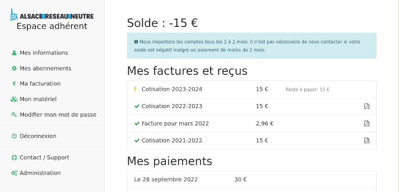

<!--
N.B.: This README was automatically generated by <https://github.com/YunoHost/apps/tree/master/tools/readme_generator>
It shall NOT be edited by hand.
-->

# Coin for YunoHost

[](https://ci-apps.yunohost.org/ci/apps/coin/)  

[](https://install-app.yunohost.org/?app=coin)

*[Read this README in other languages.](./ALL_README.md)*

> *This package allows you to install Coin quickly and simply on a YunoHost server.*  
> *If you don't have YunoHost, please consult [the guide](https://yunohost.org/install) to learn how to install it.*

## Overview

COIN is an Information System designed for associative ISPs in the FFDN.

### Features

- Provide a nice, clean UI for members
- Manage memberships
- Handle service requests for VPN, VPS, Housing, external accounts, etc,
    - including IP pools management
    - custom hooks can be added to interface with the actual infrastructure and provision services from the admin
    - members can get status info regarding their services
    - handle invoices, send reminders, import payment from bank, derive a member balance
- Optional features: mailing list, hardware provisionning


**Shipped version:** 20231216~ynh1

## Screenshots



## Documentation and resources

- Official app website: <https://code.ffdn.org/FFDN/coin>
- Upstream app code repository: <https://code.ffdn.org/ffdn/coin>
- YunoHost Store: <https://apps.yunohost.org/app/coin>
- Report a bug: <https://github.com/YunoHost-Apps/coin_ynh/issues>

## Developer info

Please send your pull request to the [`testing` branch](https://github.com/YunoHost-Apps/coin_ynh/tree/testing).

To try the `testing` branch, please proceed like that:

```bash
sudo yunohost app install https://github.com/YunoHost-Apps/coin_ynh/tree/testing --debug
or
sudo yunohost app upgrade coin -u https://github.com/YunoHost-Apps/coin_ynh/tree/testing --debug
```

**More info regarding app packaging:** <https://yunohost.org/packaging_apps>
